<<<<<<< HEAD
# XDS 功率计 PC 数据监视工具（XdsWokSpace）

**XdsWokSpace** 是一款专为 XDS（喜德盛）及兼容 BLE
协议的自行车功率计开发的 **Windows 端蓝牙监视工具**。\
通过该工具，你可以在无需手机 App
的情况下实时监控功率计数据，并进行调试、验证与数据分析。

------------------------------------------------------------------------

## 🚴 项目特点与核心功能

### ⚡ 实时监测

-   **功率（Power）**：实时功率 / 平均功率 / 峰值功率\
-   **踏频（Cadence）**：精准计算 RPM，具备自动归零与防抖逻辑\
-   **左右平衡（L/R Balance）**：显示左右腿输出比例\
-   **角度（Angle）**：曲柄实时角度\
-   **设备状态码（Error）**

### 🔍 设备扫描与过滤

-   自动扫描附近 BLE 设备\
-   智能匹配名称含 `XDS`、`Power` 的设备\
-   显示信号强度 RSSI\
-   支持重新扫描 / 手动选择设备

### 🔌 稳定连接与恢复

-   自动保持连接\
-   断线自动检测\
-   数据中断后的自动重连机制

### 📊 统计功能

-   统计骑行时长\
-   平均踏频智能计算（过滤踩踏区间）\
-   平均功率与最大功率跟踪

------------------------------------------------------------------------

### 📂 项目目录结构说明

```text
XdsWokSpace/                                      ← 项目根目录
│                                                 存放整个工程的所有源代码、库与配置文件
│
├── 📂 Library/                                   [第三方依赖库目录]
│   │                                             项目编译所需的外部依赖统一放置于此，
│   │                                             （无需额外安装环境）
│   │
│   ├── 📂 include/                               [头文件目录]
│   │      ├── SimpleBLE/                         SimpleBLE 的 C++ 头文件（蓝牙操作 API）
│   │      ├── fmt/                               fmt 格式化库头文件
│   │      └── 其他 .h/.hpp                       其它第三方库的头文件
│   │
│   │      （作用）
│   │      ✔ 提供外部库的函数、类、结构体声明
│   │      ✔ main.cpp / ble_manager.cpp 会通过 #include 调用这些接口
│   │      ✔ VS 项目会将此目录加入“附加包含目录（Include Directories）”
│   │
│   └── 📂 lib/                                   [静态库目录]
│          ├── SimpleBLE.lib                      SimpleBLE 预编译库，负责 BLE 底层实现
│          ├── fmt.lib                            fmt 的静态库
│          └── otherlibs.lib                      其他可能使用的第三方库
│
│          （作用）
│          ✔ 编译链接阶段由 VS 链接器加载
│          ✔ 将底层蓝牙、格式化等功能嵌入最终的可执行文件中
│          ✔ 避免用户本机必须安装 SimpleBLE
│
├── 📂 src/                                       [核心源代码目录]
│   │                                             所有业务逻辑与程序核心功能均在此实现
│   │
│   ├── 📄 main.cpp                               [程序入口]
│   │      （主要职责）
│   │      1. 初始化程序环境（日志、时间、蓝牙模块等）
│   │      2. 创建 BLE 管理对象（BleManager）并启动扫描
│   │      3. 发现目标功率计后发起连接
│   │      4. 设置 Notify 回调 → 当接收到蓝牙数据时调用 data_parser
│   │      5. 控制程序主循环：事件处理、异常捕获、退出逻辑
│   │      6. 输出实时功率、踏频等解析结果
│   │
│   ├── 📄 ble_manager.cpp                        [蓝牙管理模块]
│   │      （主要职责）
│   │      1. 封装 SimpleBLE API（Adapter、Peripheral、Characteristic）
│   │      2. 执行设备扫描 → 并按条件过滤（名称/UUID/MAC 等）
│   │      3. 建立连接并发现特征值（Characteristic）
│   │      4. 订阅 Notify → 接收功率计实时广播数据
│   │      5. 处理断线、重连、蓝牙异常等情况
│   │
│   ├── 📄 data_parser.cpp                        [数据解析模块]
│   │      （主要职责）
│   │      1. 接收来自 BLE 的原始字节流 RawData（uint8_t[]）
│   │      2. 按照功率计协议解析字段：
│   │          • 功率值（Instant Power）
│   │          • 踏频（Cadence）
│   │          • 扭矩（Torque）
│   │          • 时间戳/计数器等数据
│   │      3. 校验数据长度、CRC/校验和、异常值过滤
│   │      4. 输出结构化数据（PowerData 结构体）
│   │
│   └── 📄 utils.cpp                              [通用工具模块]
│          （主要职责）
│          ✔ 字节数组转十六进制字符串（调试用）
│          ✔ 小端字节序转 int16/int32
│          ✔ 时间戳获取与间隔计算（用于判断超时/掉线）
│          ✔ 日志辅助输出/格式化
│          ✔ 常用数学或格式化工具
│
├── 📄 XdsWokSpace.vcxproj                        [VS 项目配置文件]
│       （作用）
│       • 定义 C++ 编译器设置（标准、预处理宏等）
│       • 指定 src/ 与 Library/include 的路径
│       • 指定 Library/lib 的链接路径
│       • 指定要链接的 .lib 文件（如 SimpleBLE.lib）
│       • 定义 Debug/Release、x64/x86 编译配置
│
├── 📄 XdsWokSpace.sln                            [VS 解决方案文件]
│       （作用）
│       • Visual Studio 的项目入口
│       • 包含项目组织结构、调试配置、依赖关系等
│       • 双击即可在 VS 打开整个工程
│
└── 📄 README.md                                  [项目说明文档]
        ✔ 项目简介（BLE 功率计解析工具）
        ✔ 编译运行步骤
        ✔ 依赖库说明（SimpleBLE）
        ✔ 如何扫描、连接设备
        ✔ 常见问题
```

------------------------------------------------------------------------

## 🛠️ 构建环境与依赖

### 必要环境

-   **Windows 10 / 11**
-   必须带 **蓝牙 4.0+** （BLE）功能的电脑（否则无法扫描到蓝牙设备）

### 项目使用的第三方库

-   **SimpleBLE**（核心 BLE 通信库）
-   **fmt**（格式化输出库）

项目已包含所有必须依赖，无需额外下载，只需保证 `Library`
文件夹完整即可。

### 编译步骤

1.  使用 VS 打开 `XdsWokSpace.sln`

2.  选择：

    -   配置：**Release**\
    -   平台：**x64**

3.  点击 **"生成解决方案"**

4.  成功后运行：

        x64/Release/XdsWokSpace.exe

------------------------------------------------------------------------

## 📖 使用教程（超详细版）

### 第 1 步：准备功率计与电脑

1.  打开电脑蓝牙\
2.  轻拍三下唤醒功率计\
3.  **务必关闭手机骑行软件与蓝牙连接**

------------------------------------------------------------------------

### 第 2 步：启动程序并自动扫描

运行 `XdsWokSpace.exe` 后，会自动进行约 5 秒的扫描。\
扫描后显示类似以下界面：

    ---------------------------------------------------------------
     ID | 设备名称 (Identifier) | MAC 地址          | 信号 | UUIDs
    ---------------------------------------------------------------
    ⭐[0] XDS Power Meter        | C3:32:01:03:xx:xx | -62  | ...
      [1] Unnamed                | 9A:CD:xx:xx:xx:xx | -80  | ...
    ---------------------------------------------------------------

含义说明：

-   `⭐`：自动推荐连接的设备\
-   输入 `ID（如 0）` 连接设备\
-   输入：
    -   `r` → 重新扫描\
    -   `q` → 退出程序

------------------------------------------------------------------------

### 第 3 步：实时监控界面说明

成功连接后你将看到：

    [02:15] PWR: 185/150/428W | CAD: 85/82 | L/R: 48/52 | Ang: 124° | E:0

字段说明：

  字段        含义       说明
  ----------- ---------- ------------------------------
  `[MM:SS]`   运行时间   连接后的时长
  `PWR`       功率       实时 / 平均 / 最大
  `CAD`       踏频       实时 RPM / 平均 RPM
  `L/R`       左右平衡   左腿 / 右腿 占比
  `Ang`       角度       曲柄当前角度
  `E`         错误码     0 为正常，其他为硬件返回状态

------------------------------------------------------------------------

### 第 4 步：退出程序

按 **Ctrl + C** 即可安全断连。

------------------------------------------------------------------------

## ❓ 常见问题（FAQ）

### 1. 扫描不到功率计？

请检查： - 功率计是否被手机 App 占用\
- 是否已唤醒设备\
- 电脑蓝牙是否正常，是否支持蓝牙 4.0+\
- 多次输入 `r` 重新扫描

### 2. 连接后没有数据？

-   曲柄未旋转\
-   数据包未发送\
-   BLE 连接出现缓存异常 → 断开重连即可

### 3. 踏频一直为 0？

-   程序内置防抖，需要连续踩踏\
-   停止踩踏超过 2.5s 踏频自动归零
------------------------------------------------------------------------
### 项目运作流程图

```mermaid
flowchart TD
    %% --- 定义节点样式 ---
    classDef process fill:#e3f2fd,stroke:#1565c0,stroke-width:2px;
    classDef decision fill:#fff9c4,stroke:#fbc02d,stroke-width:2px;
    classDef terminator fill:#ffcdd2,stroke:#c62828,stroke-width:2px;
    classDef storage fill:#f0f4c3,stroke:#827717,stroke-width:2px;
    classDef async fill:#e1bee7,stroke:#4a148c,stroke-width:2px,stroke-dasharray: 5 5;

    %% --- 主程序入口 ---
    Start((程序启动<br>main)):::terminator --> SetSignal[设置信号处理<br>SIGINT]:::process
    SetSignal --> InitMonitor[实例化 XdsMonitor]:::process
    InitMonitor --> RunMonitor[调用 monitor.run]:::process

    %% --- XdsMonitor::run() 主逻辑 ---
    subgraph MainLoop [🔁 主运行循环 / XdsMonitor::run]
        direction TB
        
        RunMonitor --> InitAdapter{初始化适配器<br>initAdapter}:::decision
        InitAdapter -- 失败 --> EndProgram((退出程序)):::terminator
        InitAdapter -- 成功 --> ScanStep[调用 scanAndSelectDevice]:::process

        %% 扫描与选择逻辑
        ScanStep --> BLEScan[执行 BLE 扫描 5秒]:::process
        BLEScan --> ShowList[打印设备列表]:::process
        ShowList --> CheckAuto{是否自动重连?}:::decision
        
        CheckAuto -- 是 --> SetTarget[锁定上次设备]:::process
        CheckAuto -- 否 --> UserInput[/用户输入 ID/r/q/]:::storage
        
        UserInput -- "q (退出)" --> EndProgram
        UserInput -- "r (重试)" --> BLEScan
        UserInput -- "ID (选中)" --> SetTarget

        %% 连接逻辑
        SetTarget --> ConnectStep[调用 connectDevice]:::process
        ConnectStep --> DoConn{连接成功?}:::decision
        
        DoConn -- 否 --> WaitRetry[等待 3秒]:::process
        WaitRetry --> BLEScan
        
        DoConn -- 是 --> FindSvc{发现服务/特征值?<br>1828 / 2a63}:::decision
        FindSvc -- 否 --> Disconnect[断开连接]:::process
        Disconnect --> WaitRetry
        
        %% 监控逻辑
        FindSvc -- 是 --> StartMon[调用 startMonitoring]:::process
    end

    %% --- 监控与数据流 ---
    subgraph MonitorLogic [⚡ 监控阶段 / startMonitoring]
        direction TB
        StartMon --> Subscribe[订阅 Notify 回调]:::process
        Subscribe --> InitStats[重置统计数据<br>startTime, maxPower...]:::process
        
        %% 保持连接的循环
        InitStats --> CheckConn{检查连接状态<br>& 超时}:::decision
        CheckConn -- "连接断开/用户停止" --> Unsub[取消订阅 & 断开]:::process
        Unsub --> WaitReconnect[准备重连]:::process
        WaitReconnect --> BLEScan
        
        CheckConn -- "正常运行" --> Sleep[Sleep 100ms]:::process
        Sleep --> CheckConn
    end

    %% --- 异步数据处理回调 ---
    subgraph DataPipeline [⚙️ 数据处理流水线 / onDataReceived]
        direction TB
        
        %% 触发源
        BLEEvent(BLE Notify 事件):::async -.-> |ByteArray| ParseRaw[解析原始数据]:::process
        
        %% 1. 基础解析
        ParseRaw --> GetVal1[解析 Power/L/R/Angle<br>getUnsigned/SignedValue]:::process
        
        %% 2. 踏频算法
        GetVal1 --> CalcCadence{是第一个包?}:::decision
        CalcCadence -- 是 --> InitCadence[记录初始圈数]:::process
        CalcCadence -- 否 --> DiffCalc[计算圈数差 & 时间差]:::process
        DiffCalc --> ValidDiff{差值有效?}:::decision
        ValidDiff -- "是 (>0)" --> ComputeRPM[计算瞬时 RPM]:::process
        ValidDiff -- "否 (超时>2.5s)" --> ZeroRPM[RPM 置 0]:::process
        
        %% 3. 统计更新
        ComputeRPM --> UpdateStatsCalc[更新统计数据<br>Avg/Max Power, Balance]:::process
        ZeroRPM --> UpdateStatsCalc
        InitCadence --> UpdateStatsCalc
        
        %% 4. UI 输出
        UpdateStatsCalc --> PrintUI[/格式化打印 Console<br>清除当前行并刷新/]:::storage
    end

    %% 关联关系
    Subscribe -.-> |注册回调| BLEEvent
```

